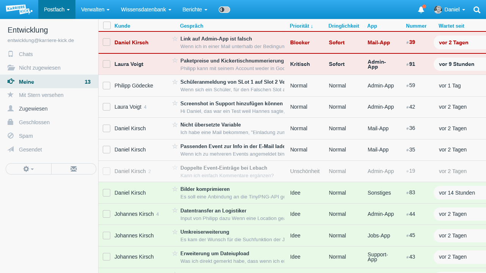

# About
This FreeScout module makes Custom Fields sortable in [FreeScout](https://freescout.net).

# Requirements
* Existing [FreeScout](https://freescout.net) installation
* Installed [Custom Field Module](https://freescout.net/module/custom-fields/)

# Installation
You may [install this module like any other FreeScout module](https://github.com/freescout-helpdesk/freescout/wiki/FreeScout-Modules#2-installing-official-modules).

Go to the "src" directory of this repository and copy the folder "SortableCustomFields" into your "Modules" folder of your [FreeScout](https://freescout.net) installation.

Go to the "Modules" section in FreeScout and activate "Sortable Custom Fields"

# Usage
Every Custom Field you create in the Custom Fields module becomes a column in your conversation tables and is sortable by its values.

You may style your rows with CSS depending on the defined Custom Fields.

Each Custom Field will add a class to the tr element and it's corresponding td element in the table. 
(It will be created using Laravels [Str::slug() class](https://laravel.com/docs/10.x/strings#method-str-slug))

Assuming you have a Custom Field "Priority" with the values 
* "High"
* "Medium"
* "Low"
* "New idea"

You will get the following CSS classes
* "cf_priority_high"
* "cf_priority_medium"
* "cf_priority_low"
* "cf_priority_new-idea"

You may use the official FreeScout [Customization & Rebranding Module](https://freescout.net/module/customization/) to add your own CSS.

## Example CSS for styling custom fields

    /* Change the color values to fit your needs. */
    :root {
        --bg-high: #f001;
        --color-high: #b00;

        --bg-idea: #0f01;
        --color-idea: #0b0;
    }

    /* reset font weight for normal rows */
    .conv-row td a {
        font-weight: normal;
    }

    .conv-row.cf_priority_high td {
        background-color: var(--bg-high);
        border-top: 2px solid var(--color-high);
    }

    .conv-row.cf_priority_high td a {
        font-weight: bold;
        color: var(--color-high);
    }

    .conv-row.cf_priority_low td {
        opacity: 0.5;
    }

    .conv-row.cf_priority_new-idea td {
        background-color: var(--bg-idea);
    }

# Future Ideas
* Define the position where a Custom Field column should be placed to.
* Make a selection to select which columns should be visible (independent of the setting in Custom Fields). This should be saved as a property of each user's profile.
* Editable values for Custom Fields directly in the table